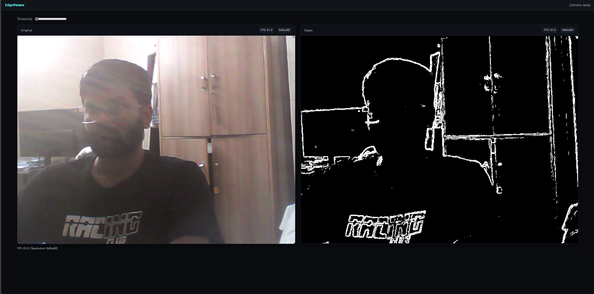
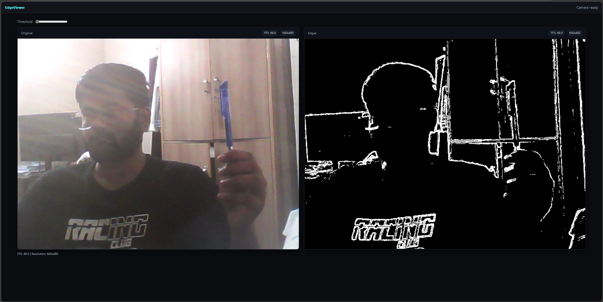

# EdgeViewer — Real‑Time Canny Edge Detection (Android + OpenCV + OpenGL ES + Web)

Production‑ready, minimal, and modular. The Android app opens directly into a live camera view, runs real‑time Canny edge detection in native C++ (OpenCV when available, efficient CPU fallback otherwise), and renders via OpenGL ES. A companion web UI shows side‑by‑side Original and Edges using your browser camera (or incoming frames), useful for demos and validation.

## Key Features
- Instant startup: camera + edge detection auto‑start on launch
- Native processing: JNI → C++ pipeline (OpenCV Canny or fast fallback)
- Efficient rendering: OpenGL ES grayscale texture upload and draw
- Stable camera pipeline: Camera2 with `ImageReader` (YUV_420_888 → RGBA)
- Web viewer: side‑by‑side Original and Edges with live FPS/resolution
- Clean architecture and CMake/Gradle wiring; easy to extend

## Demo (drop-in screenshots)

Place the two images below at `docs/media/original.jpg` and `docs/media/edges.jpg` to render in README. The relative paths below are explicit for GitHub/VSC previews:

| Original | Edges |
| --- | --- |
|  |  |

If you don’t have them yet:
- Web: open `web/public/index.html`, allow camera, take screenshots of both panels.
- Android: run the app, take a system screenshot of the live view.

## Tech Stack
- Android (Kotlin)
- NDK + JNI (C++)
- OpenCV (C++) — optional but recommended
- OpenGL ES 2.0+
- TypeScript/Vanilla JS (web viewer)

## Project Structure

```
.
├─ android/                 # Android Gradle project
│  ├─ app/
│  │  ├─ src/main/java/...  # Kotlin sources (Camera2, pipeline, UI)
│  │  ├─ src/main/cpp/      # Thin JNI glue → links to ../jni and ../gl
│  │  └─ src/main/res/      # Android resources
│  ├─ build.gradle          # (Project-level)
│  └─ settings.gradle
├─ jni/                     # Native C++ (image processing)
│  ├─ CMakeLists.txt
│  └─ src/
│     ├─ opencv_pipeline.cpp
│     └─ opencv_pipeline.hpp
├─ gl/                      # OpenGL ES renderer (C++)
│  ├─ CMakeLists.txt
│  └─ src/
│     ├─ gl_renderer.cpp
│     └─ gl_renderer.hpp
├─ web/                     # Web viewer (side‑by‑side original/edges)
│  ├─ public/index.html
│  ├─ public/edge.js
│  ├─ package.json
│  └─ tsconfig.json
└─ docs/media/              # Put README screenshots here (original.jpg, edges.jpg)
```

## Android — Build & Run
1. Open `android/` in Android Studio (latest stable).
2. Install NDK + CMake from SDK Manager.
3. Ensure `local.properties` points to valid SDK/NDK.
4. Build and run on a physical device.

Behavior:
- App launches straight into live camera preview.
- Each frame → YUV to RGBA → JNI → Canny → OpenGL upload → on‑screen.
- Frame size changes are handled: buffers resize and GL viewport updates.

### OpenCV Integration (optional, enables native Canny)
If you have OpenCV Android SDK installed:
1. Set `OpenCV_DIR` to the SDK CMake folder (contains `OpenCVConfig.cmake`). For example on Windows:
   - `C:/Company_Assignment/OpenCV-android-sdk/sdk/native/jni`
2. `android/app/build.gradle` already forwards this path to CMake via `externalNativeBuild.cmake.arguments`.
3. Rebuild. When found, `EDGEVIEWER_USE_OPENCV` is defined and OpenCV’s `core`/`imgproc` are linked.

If OpenCV is not present, a fast CPU fallback approximates edges (Sobel‑based) so the app remains fully functional.

### Permissions & Manifest
`android/app/src/main/AndroidManifest.xml` includes camera, network and cleartext flags. We also declare:
```
<uses-feature android:name="android.hardware.camera.any" android:required="true" />
```
This filters devices without cameras and clarifies requirement.

### Performance Notes
- Conversion: YUV → RGBA done on the CPU with low allocation (reused buffers).
- Processing: OpenCV Canny if available; otherwise lightweight Sobel fallback.
- Rendering: one grayscale texture uploaded per processed frame, drawn via simple quad.
- Tuning: thresholds (e.g., 80/200) chosen for crisp edges; adjust as needed per device/scene.

### Troubleshooting
- Black/blank view: ensure GL surface is initialized, and `GLBridge.resize(width,height)` is called after the first frame size is known.
- Poor performance: try lowering input resolution (e.g., 640×480) or process every Nth frame.
- OpenCV not linking: verify `OpenCV_DIR` path and that ABIs match your `ndk.abiFilters`.

## Web Viewer — Build & Run
Use your browser camera to preview Original vs. Edges.

```
cd web
npm install
npm run dev
```

Open the served `index.html` (https or localhost). Allow camera permissions. Use the threshold slider to tune edge strength. Both canvases display live FPS and resolution.

## Security & Privacy
- Camera frames stay on‑device in both Android and Web demos.
- If you enable any network endpoints, prefer localhost during development and use HTTPS in production.

## Contributing
- Keep code readable and modular (JNI boundaries small, clear data ownership).
- Avoid hidden allocations in hot paths.
- Prefer explicit lifecycles: init → start → stop → shutdown.

## License
MIT


